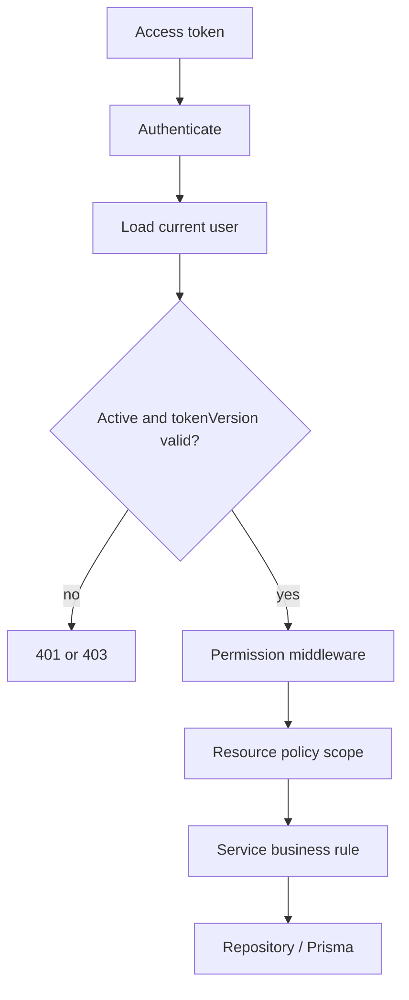

# RBAC and authorization architecture

## Decision

CRM Connect is currently a single-organization CRM. Authorization uses a hybrid model:

- RBAC grants coarse permissions from `ADMIN`, `MANAGER`, and `EMPLOYEE`.
- Resource policies restrict data by `ownerId`, `createdById`, and `assigneeId`.
- Business rules validate state such as active assignees and preservation of at least one active admin.

The backend is the source of truth. Mobile capabilities only control presentation and never replace server authorization.

## Request flow



`authenticate` loads the current role, status, and `tokenVersion` from PostgreSQL. It does not trust a possibly stale role claim in the JWT. Role, status, and password changes increment `tokenVersion`, so existing access tokens stop working immediately. Active refresh sessions are revoked at the same time.

## Permission matrix

| Capability | Employee | Manager | Admin |
| --- | --- | --- | --- |
| Read customer | Own | Any | Any |
| Create customer | Yes, self becomes owner | Yes, self becomes owner | Yes, self becomes owner |
| Update/delete customer | Own | Any | Any |
| Read task | Assigned or created | Any | Any |
| Create task | For an accessible customer | For any accessible customer | For any customer |
| Assign task | Self only | Any active user | Any active user |
| Edit task details | Created task | Any | Any |
| Update task status | Assigned task | Any | Any |
| Delete task | Created task | Any | Any |
| Create customer note | Own customer | Any customer | Any customer |
| List users | No | Yes | Yes |
| Change role/status | No | No | Yes |
| Read security audit | No | No | Yes |
| Read Admin overview | No | No | Yes |

The executable policy is in `src/modules/authorization/permissions.ts`. This document must not be treated as a second source of truth.

## Module boundaries

```text
src/
  modules/
    authorization/   permission catalog, actor and resource policies
    customers/       route -> controller -> service -> repository
    tasks/           route -> controller -> service -> repository
    notes/           route -> controller -> service
    users/           user directory and admin-only role/status changes
    security-events/ admin-only audit queries
    admin/           admin dashboard aggregation
  docs/              OpenAPI loader
  middlewares/       authentication, validation and error translation
  shared/http/       transport helpers
  services/          session rotation and security audit infrastructure
  config/            environment and database configuration
```

Controllers translate HTTP only. Services own authorization-sensitive business rules. Repositories own Prisma queries. Resource filters are constructed centrally in authorization policies so a feature cannot accidentally forget ownership constraints.

## Security invariants

1. Public registration always creates an `EMPLOYEE`.
2. The client cannot supply role, status, owner, creator, or note author fields.
3. Unauthorized resource access returns `404` after a scoped query to avoid confirming another user's record exists.
4. Only active users can authenticate, refresh a session, or receive a task assignment.
5. Role and status changes revoke all refresh sessions and invalidate existing access tokens.
6. The final active admin cannot be demoted or disabled.
7. Denied permission checks and administrative changes are written to `SecurityEvent`.
8. Refresh tokens remain rotated, hashed, device-scoped, and protected by reuse detection.

## API surface

| Method | Endpoint | Required permission |
| --- | --- | --- |
| GET | `/api/customers` | `customer:read:own` plus resource scope |
| POST | `/api/customers` | `customer:create` |
| PATCH | `/api/customers/:id` | `customer:update:own` plus resource scope |
| DELETE | `/api/customers/:id` | `customer:delete:own` plus resource scope |
| GET | `/api/tasks` | `task:read:related` plus resource scope |
| POST | `/api/tasks` | `task:create` |
| PATCH | `/api/tasks/:id` | `task:update:created` plus resource scope |
| PATCH | `/api/tasks/:id/status` | `task:status:assigned` plus resource scope |
| GET | `/api/users` | `user:read:any` |
| PATCH | `/api/users/:id/role` | `user:manage:role` |
| PATCH | `/api/users/:id/status` | `user:manage:status` |
| GET | `/api/security-events` | `security-event:read` |
| GET | `/api/admin/overview` | `admin:overview:read` |

Higher roles inherit the lower-level route permission and receive broader scopes through their additional `*:any` permission.

## Mobile Admin Lite

Mobile không cho người dùng chọn role lúc đăng nhập. Sau khi login/bootstrap, backend trả danh sách permission hiện hành. `authenticatedExperience()` chỉ mở `AdminNavigator` khi có `admin:overview:read`; các tài khoản khác vào `CrmNavigator`.

Admin Lite gồm:

- Overview: số lượng user/customer/task, active sessions, cảnh báo 24 giờ và sự kiện gần nhất.
- User Management: tìm kiếm, lọc, phân trang, đổi role/status; backend thực thi quy tắc không tự khóa và không loại bỏ active Admin cuối cùng.
- Security Events: nhật ký chỉ đọc, lọc theo loại sự kiện và phân trang.
- CRM Operations: dùng lại các màn hình khách hàng/công việc, nhưng capability của resource vẫn do backend quyết định.

Ẩn nút hoặc đổi navigator không phải biện pháp bảo mật. Mọi endpoint Admin vẫn yêu cầu JWT hợp lệ và permission middleware ở backend.

## API documentation

OpenAPI 3.0.3 được duy trì tại `docs/openapi.yaml`, phục vụ ở `/api/openapi.json` và Swagger UI `/api-docs`. Thay đổi route/schema phải cập nhật file này và test `openapi.test.ts` trong cùng pull request.

## Multi-tenant boundary

This design is correct for the current single-organization product. If CRM Connect later serves multiple companies, do not make `MANAGER` global. Add `Organization` and `Membership(userId, organizationId, role)`, add `organizationId` to every business aggregate, include the selected membership in the authenticated actor, and apply tenant scope before every ownership policy.
